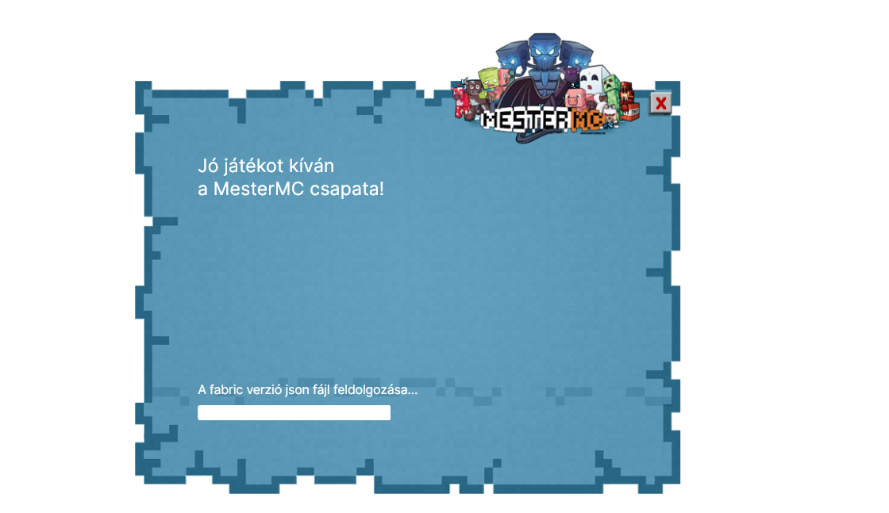
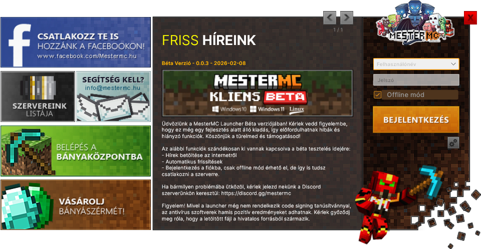
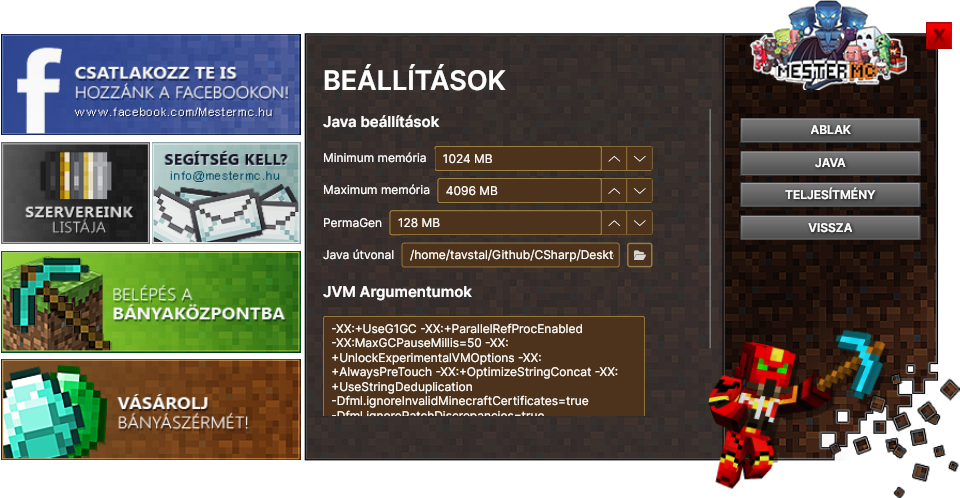
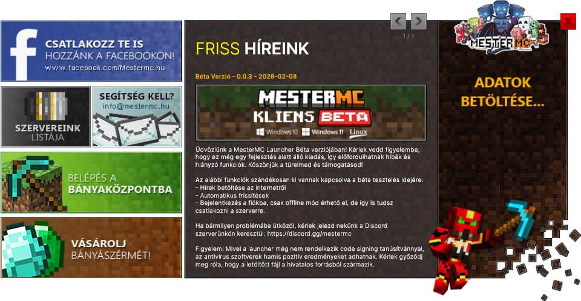
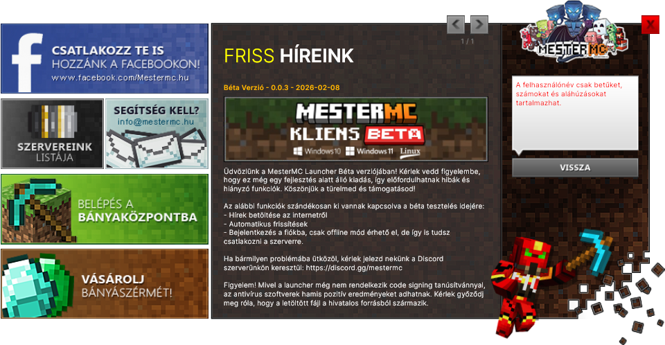
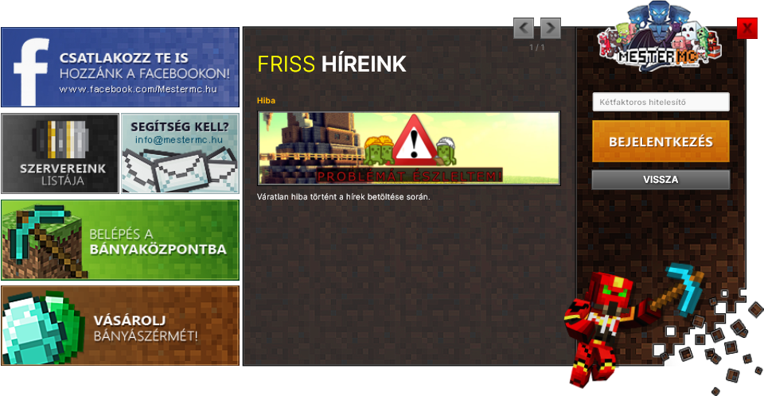

# MesterMC Launcher

> [WARNING]
> **Project Status: Discontinued** 

> This launcher is no longer maintained. The source code is provided for **educational purposes**. 
> Please check out the todo list in the [todo.md](./docs/todo.md) file for a list of features and improvements that were planned during active development.

## Description
MesterMC Launcher was the official custom Minecraft entry point for the MesterMC network. 
Built to be lightweight and efficient, it utilizes the backend logic of the [Konkord Launcher](https://github.com/TavstalDev/KonkordLauncher).

### Tech Stack
- **Framework:** [Avalonia UI](https://avaloniaui.net/) (Cross-platform XAML)
- **Runtime:** .NET 9 (C#)
- **OS Support:** Windows 10/11, Linux, MacOS (planned but not tested)

---

### Important Misconceptions
To clarify the scope and intent of this project:

- **Launcher vs. Client:** This is a **Launcher**. Its sole responsibility is downloading files and executing the JVM with correct parameters.
- **Security & Anti-Cheat:** There are **no built-in anti-cheat** or anti-tamper features.
- **EULA Compliance:** Developing a "secure" custom client often requires redistributing modified Minecraft binaries, which violates Mojang's EULA. 
This project was designed to remain lightweight and legally compliant rather than implementing invasive security measures.

---

## Screenshots

## Installation

Please check the [installation guide](./docs/installation.md) for detailed instructions on how to install and set up the MesterMC Launcher on your system.

## Contributing
While this project is no longer maintained, contributions are still welcome for educational purposes. 
If you have improvements or fixes, please feel free to submit a pull request. 
For more details on contributing, please refer to the [contributing guidelines](./CONTRIBUTING.md).

## License & Disclaimer

This project is licensed under the **GNU General Public License v3.0**.
- **Disclaimer**: This project is not affiliated with Mojang AB or Microsoft Corporation. The project is no longer affiliated with the MesterMC network and is provided for educational purposes only.
- **Assets**: UI textures and design references are not owned by the project.
- **Stability**: While extensively tested for reliability during active development, the software is provided "as is".
- **Liability**: As the project is no longer maintained to account for new OS or API changes, the author is not responsible for any issues arising from its use. **Use at your own risk.**

## Contact

For any questions, bug reports, or feature requests, please use the [GitHub issue tracker](https://github.com/TavstalDev/MesterMC-Launcher/issues).

## Acknowledgements
- Mojang for creating the game and providing the necessary APIs for launcher development.
- AvaloniaUI for providing a cross-platform UI framework.
- MesterMC community for helping with testing and providing feedback during development.
- The original developers of the java version of the launcher, who made the textures and the design of the launcher, which was used as a reference for the design of this launcher.
- [Konkord Launcher](https://github.com/TavstalDev/MesterMC-Launcher/)