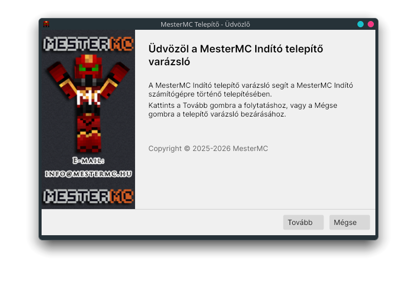
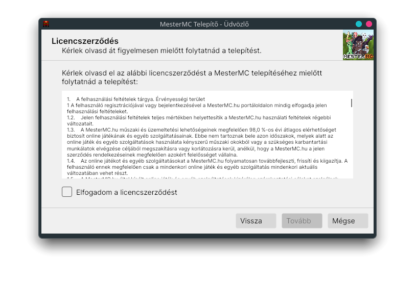
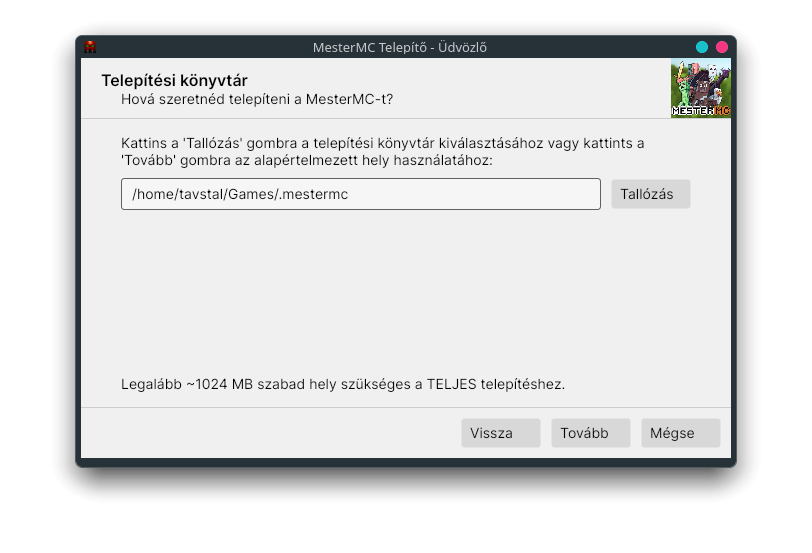
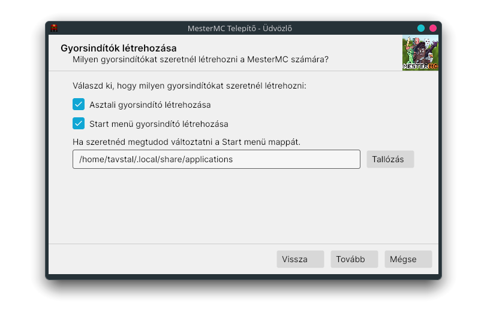
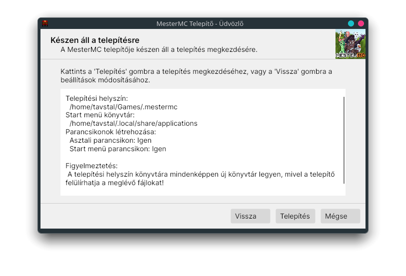
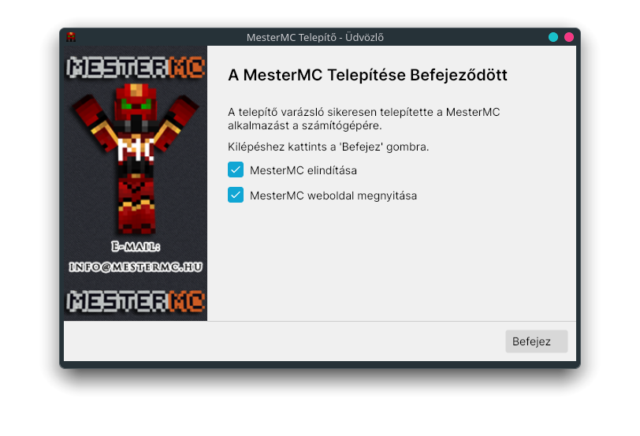

# Installation

To install the MesterMC Launcher, follow the instructions below based on your operating system.

## Steps

1. Download the latest release of the MesterMC Launcher from the [releases page](https://github.com/TavstalDev/MesterMC-Launcher/releases)
   - For Windows, download the `MMC-Launcher-<version>-Win.exe` file.
   - For Linux, download the `MMC-Launcher-<version>-Linux` file.
   - For MacOS, there is currently no pre-built version available. Please follow the build instructions to build the launcher from source.
2. Make the downloaded file executable if necessary (Linux and MacOS):
   - Linux: Run `chmod +x MMC-Launcher-<version>-Linux` in the terminal.
   - MacOS: Run `chmod +x MMC-Launcher-<version>-Mac` in the terminal.
3. Run the downloaded installer or executable file and follow the on-screen instructions to complete the installation process.
4. Once the installation is complete, you can launch the MesterMC Launcher from your applications menu or desktop shortcut.

## Installation images

